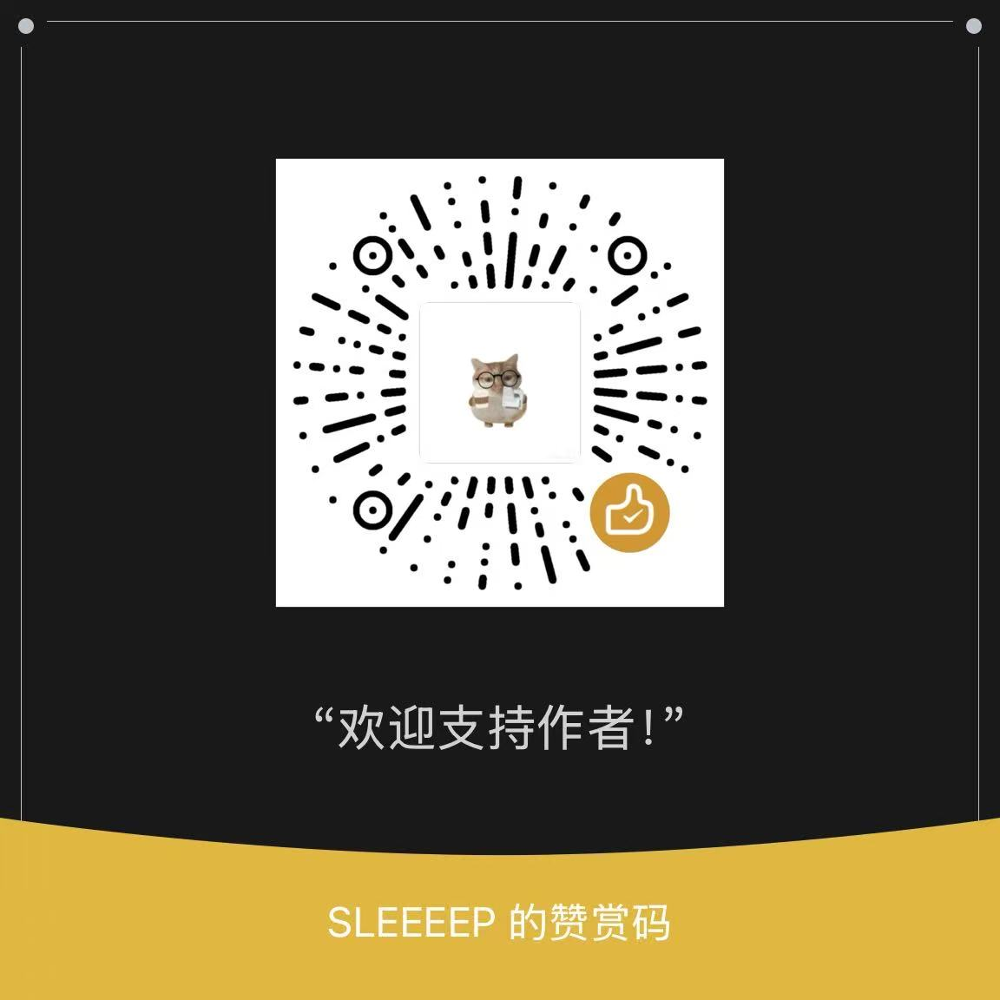
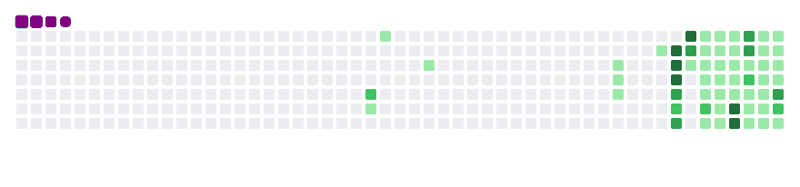

# 👋 Hi, I'm Q · 你好，我是 Q

**PhD Candidate in Biomedical Engineering @ [Tsinghua University](https://www.tsinghua.edu.cn/)**
清华大学 · 生物医学工程 博士在读

> **Medical-Engineering Interdisciplinary · AI4S · Organoids-on-Chip (Microfluidics)**
> 医工交叉 · AI4S · 类器官芯片（微流控）

<b>🇬🇧 English · 英文版</b>

### Tech Stack

- **Research** — Microfluidics · Organoids-on-Chip · AI for Science
- **AI & Agents** — LLM Agents · MCP Servers · Prompt Engineering
- **Bioinformatics** — NCBI · BLAST · PDB · UniProt · Enrichment Analysis
- **Python & Data** — Python · R · Web Scraping · Data Processing
- **Visualization & Frontend** — WebGL · 3D Visualization

### Education

-  **PhD Candidate in Biomedical Engineering** · [Tsinghua University](https://www.tsinghua.edu.cn/)
-  **B.Sc.** · [Shenyang Pharmaceutical University](https://www.syphu.edu.cn/)

### Experience

-  **CapitalBio Group** (Beijing National Engineering Research Center for Biochip Technology) — Intern · `2025.12 – 2031.6`
-  **Siogens** — Medical Affairs Intern · `2026.07 – 2026.09`
-  **Beijing Nuokangda Pharmaceutical** — AI Algorithm Intern · AI Automation Dept · `2025.10 – 2025.12`
-  **Cancer Hospital, Chinese Academy of Medical Sciences (National Cancer Center)** — Research Intern · `2022.10 – 2026.04`

### Open Source Projects

**⭐ Featured**

- 🧬 **[BioMCP](https://github.com/qgeng1465/bio-mcp)**  — bioinformatics MCP server · **38 databases · 73 tools** · **`pip install biomcp-server`** (intelligent agent + honest agent)
- ✈️ **[Flight Trajectory 3D](https://github.com/qgeng1465/flight-trajectory-visualizer)** — flight logbook on a WebGL 3D globe, 100% local & private
- 🎬 **[LiveRecorder](https://github.com/qgeng1465/LiveRecorder)** — 24/7 FFmpeg recorder for 50+ platforms incl. WeChat Channels
- 🤖 **[AI4Bio Agents](https://github.com/qgeng1465/ai4bio-agents)** — 10 ready-to-use bioinformatics AI agents (literature / sequence / structure / BLAST)
- 🧪 **Labwright** `🔒 private · opening soon` — verifiable wet-lab AI copilot · validates protocol calculations & catches fabricated numbers (hallucination rate 0.000)

### Support

If these tools saved you time, a coffee is always appreciated ☕

  

<b>🇨🇳 简体中文 · 中文版</b>

### 技术栈

- **科研方向** — 微流控 · 类器官芯片 · AI for Science
- **AI 与智能体** — 大模型智能体 · MCP 服务器 · 提示工程
- **生物信息学** — NCBI · BLAST · PDB · UniProt · 富集分析
- **Python 与数据处理** — Python · R · 网页抓取 · 数据处理
- **可视化与前端** — WebGL · 3D 可视化

### 教育经历

-  **生物医学工程 博士在读** · [清华大学](https://www.tsinghua.edu.cn/)
-  **本科** · [沈阳药科大学](https://www.syphu.edu.cn/)

### 工作经历

-  **博奥生物集团**（生物芯片北京国家工程研究中心）· 实习 · `2025.12 – 2031.6`
-  **上海硅致智能** · 医学事务部 实习生 · `2026.07 – 2026.09`
-  **北京诺康达医药科技股份有限公司** · AI 自动化设备部 · 算法实习生 · `2025.10 – 2025.12`
-  **中国医学科学院肿瘤医院（国家癌症中心）** · 科研实习 · `2022.10 – 2026.04`

### 开源项目

**⭐ 重点推荐**

- 🧬 **[BioMCP](https://github.com/qgeng1465/bio-mcp)**  — 生物信息学 MCP 服务器 · **38 个数据库 · 73 个工具** · **`pip install biomcp-server`**（智能 agent + 诚实 agent）
- ✈️ **[Flight Trajectory 3D](https://github.com/qgeng1465/flight-trajectory-visualizer)** — 飞行日志 3D 地球可视化，WebGL 渲染，纯本地隐私友好
- 🎬 **[LiveRecorder](https://github.com/qgeng1465/LiveRecorder)** — FFmpeg 24/7 直播录制，50+ 平台，支持微信视频号
- 🤖 **[AI4Bio Agents](https://github.com/qgeng1465/ai4bio-agents)** — 10 个即装即用的生信 AI 智能体（文献 / 序列 / 结构 / BLAST）
- 🧪 **Labwright** `🔒 私有 · 即将开源` — 可验证湿实验 AI 副驾 · 验证论文协议计算并拒绝虚构数字，幻觉率 0.000

### 赞赏支持

如果这些工具帮到了你，欢迎请我喝杯咖啡，支持我持续更新 ☕

  

---

<h3 align="center">📚 Project Catalog · 全部开源项目</h3>

**🧬 AI4Science & Bioinformatics · AI4科学与生物信息**

| Project | What it does · 用途 | ★ |
|---|---|---|
| [bio-mcp](https://github.com/qgeng1465/bio-mcp) | Bioinformatics MCP server · 38 databases / 73 tools · `pip install biomcp-server` · 生信 MCP 服务器 |  |
| [ai4bio-agents](https://github.com/qgeng1465/ai4bio-agents) | 10 ready-to-use bioinformatics AI agents · 生信智能体合集 |  |
| [ai4research-agents](https://github.com/qgeng1465/ai4research-agents) | 10 agents for daily research life (writing / grant / defense / stats) · 科研日常智能体 |  |
| [ai4chem-agents](https://github.com/qgeng1465/ai4chem-agents) | 10 chemistry AI agents (synthesis / spectra / docking) · 化学智能体合集 |  |
| [transdann-surv](https://github.com/qgeng1465/transdann-surv) | When GRL/DANN fails in cross-population survival prediction · 域对抗训练失效机理 |  |
| [dual-channel-mr-atlas](https://github.com/qgeng1465/dual-channel-mr-atlas) | Transcriptome-wide cis-MR × colocalization atlas for T2D & CAD · 全转录组孟德尔随机化图谱 |  |
| [pilotdeck-hippo](https://github.com/qgeng1465/pilotdeck-hippo) | Scored verbatim-retention layer for LLM context compaction · 上下文压缩的逐字保留层 |  |

**🤖 LLM & Productivity · 效率工具**

| Project | What it does · 用途 | ★ |
|---|---|---|
| [pptagent](https://github.com/qgeng1465/pptagent) | Text → native editable PPTX for academic talks · 学术 PPT 生成管线 |  |
| [astock-conservative-agent](https://github.com/qgeng1465/astock-conservative-agent) | Conservative A-share quant system with strict hold-out lessons · A股保守量化复盘 |  |

**🌐 Browser Tools — 100% local & private · 纯浏览器本地工具**

| Project | What it does · 用途 | ★ |
|---|---|---|
| [flight-trajectory-visualizer](https://github.com/qgeng1465/flight-trajectory-visualizer) | Flight logbook on an interactive WebGL 3D globe · 3D 地球飞行足迹 |  |
| [audio-toolbox](https://github.com/qgeng1465/audio-toolbox) | Video→audio, convert, trim, vocal removal · 音频工具箱 |  |
| [ts-to-mp4-converter](https://github.com/qgeng1465/ts-to-mp4-converter) | Lossless TS⇌MP4 remux (ffmpeg.wasm) · TS⇌MP4 无损转换 |  |
| [mp4-converter](https://github.com/qgeng1465/mp4-converter) | Universal video⇌MP4 converter · 通用视频转 MP4 |  |
| [emoji-maker](https://github.com/qgeng1465/emoji-maker) | Multi-frame images → WeChat-compliant GIF · 表情包制作 |  |

**📥 Media Downloaders · 媒体下载**

| Project | What it does · 用途 | ★ |
|---|---|---|
| [LiveRecorder](https://github.com/qgeng1465/LiveRecorder) | 24/7 live recorder for 50+ platforms incl. WeChat Channels · 直播录制 |  |
| [douyin-watermark-free-downloader](https://github.com/qgeng1465/douyin-watermark-free-downloader) | Douyin watermark-free video & image downloader · 抖音无水印下载 |  |
| [bilibili-video-downloader](https://github.com/qgeng1465/bilibili-video-downloader) | Bilibili downloader: multi-part / subtitles / danmaku · B站下载器 |  |
| [xiaohongshu-downloader](https://github.com/qgeng1465/xiaohongshu-downloader) | Xiaohongshu (RedNote) image/video downloader · 小红书下载器 |  |
| [youtube-downloader](https://github.com/qgeng1465/youtube-downloader) | YouTube downloader wrapping yt-dlp, proxy-aware · YouTube 下载器 |  |
| [wechat-article-exporter](https://github.com/qgeng1465/wechat-article-exporter) | WeChat article exporter to Markdown/HTML · 公众号文章导出 |  |

🔒 *Labwright* (verifiable wet-lab AI copilot) is private — opening soon · 私有仓库，即将开源

---

<h3 align="center">💻 Languages · 🛠️ Skills · 技能</h3>

  
  
  
  
  
  
  
  
  
  
  
  
  
  
  
  
  
  
  
  
  

---

<h3 align="center">📈 GitHub Contribution Snake · 贡献贪吃蛇</h3>

  

---

Open to research collaborations & part-time opportunities · 欢迎科研合作与实习机会

MIT Licensed · For educational research and personal use only · MIT 许可 · 仅供学习研究

