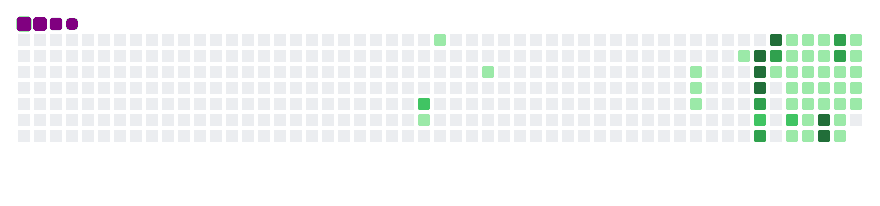

# 你好 👋 我是 Q

**清华大学 生物医学工程 博士在读**
博士研究生 · 清华大学

> **医工交叉 · AI4S · 类器官芯片（微流控）**

[**English**](README.md) | **简体中文**

---

### 🔧 技术栈

- **科研方向** — 微流控 · 类器官芯片 · AI for Science
- **AI 与智能体** — 大模型智能体 · MCP 服务器 · 提示工程
- **生物信息学** — NCBI · BLAST · PDB · UniProt · 富集分析
- **Python 与数据处理** — Python · 网页抓取 · 数据处理
- **可视化与前端** — WebGL · 3D 可视化

---

### 🎓 教育经历

-  **生物医学工程 博士在读** · [清华大学](https://www.tsinghua.edu.cn/)
-  **本科** · [沈阳药科大学](https://www.syphu.edu.cn/)

---

### 💼 工作经历

-  **博奥生物集团**（生物芯片北京国家工程研究中心）· 实习 · `2025.12 – 2031.6`
-  **上海硅致智能** · 医学事务部 实习生 · `2026.07 – 2026.09`
-  **北京诺康达医药科技股份有限公司** · AI 自动化设备部 · 算法实习生 · `2025.10 – 2025.12`
-  **中国医学科学院肿瘤医院（国家癌症中心）** · 科研实习 · `2022.10 – 2026.04`

---

### 📦 开源项目

**⭐ 重点推荐**

- 🧬 **[BioMCP](https://github.com/qgeng1465/bio-mcp)** — 生物信息学 MCP 服务器 · **36 个数据库 · 68 个工具**（智能 agent + 诚实 agent）
- ✈️ **[Flight Trajectory 3D](https://github.com/qgeng1465/flight-trajectory-visualizer)** — 飞行日志 3D 地球可视化，WebGL 渲染，纯本地隐私友好
- 🧪 **[Labwright](https://github.com/qgeng1465/labwright)** — 可验证湿实验 AI 副驾 · 验证论文协议计算并拒绝虚构数字，幻觉率 0.000

---

### ☕ 赞赏支持

如果这些工具帮到了你，欢迎请我喝杯咖啡，支持我持续更新 ☕

  

---

### 🛠️ 技能

  
  
  
  
  

  
  
  
  
  

  
  
  
  
  
  

---

### 📈 GitHub 贡献贪吃蛇

  

<picture>
  <source media="(prefers-color-scheme: dark)" srcset="github-contribution-snake/github-contribution-grid-snake-dark.svg">
  
</picture>

---

欢迎科研合作与实习机会

MIT 许可 · 尊重版权 · 仅供学习研究与个人合理使用

